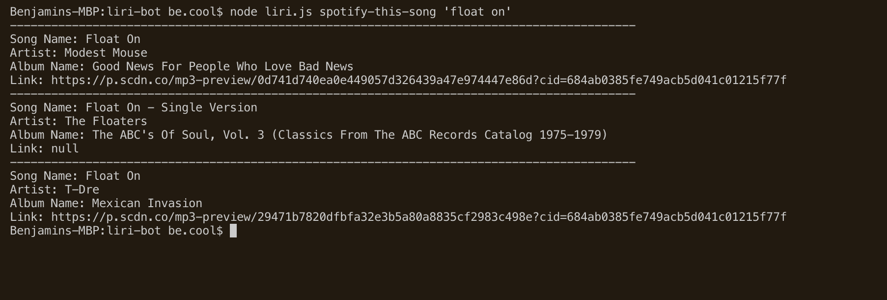

# liri-bot

Project completed by: Ben Cooley

Date: July 27th, 2019

 

I have completed a liri-bot application that uses node.js to take in user input in the terminal and return to the user data about either the movie, song or band for which they have searched.  The user will first need to navigate into the liri.js file, open it in the terminal, and then search from there.  Below you will find screenshots of each output with a description of what search is performed to produce the result.

1. The first search function is for a song.  To perform the search in the terminal, the user must input the following: node liri.js spotify-this-song 'song name' and then press enter.  This search uses the spotify api call to return to the user, in the terminal the desired info about the top 3 songs for that name they input.  Additionally, if they user does not input a song name, the application will automatically input "The Sign" and the user will see info about the song "The Sign" by Ace of Base.  Below is a screenshot to show more clearly how the app functions.

2. The second search function is for a movie.  To perform the search in the terminal, the user must input the following: node liri.js movie-this 'movie name' and then press enter.  This search uses the omdb api call to return to the user, in the terminal the desired info about the top movie for that name they input.  Additionally, if they user does not input a movie name, the application will automatically input "Mr. Nobody" and the user will see info about the movie "Mr. Nobody".  Below is a screenshot to show more clearly how the app functions.

3. The third search function is for a concert.  To perform the search in the terminal, the user must input the following: node liri.js concert-this 'band name' and then press enter.  This search uses the spotify api call to return to the user, in the terminal the desired info about some upcoming concerts for the band they input.  Below is a screenshot to show more clearly how the app functions.

4. Finally, if the user inputs "node liri.js do-what-it-says" the application will automatically pull in the data from the random.txt file and create a call with that input.  In this case you will see that it is for the song "I want it that way" by the Backstreet Boys.

 I hope you like the app and get some good use out of it!

